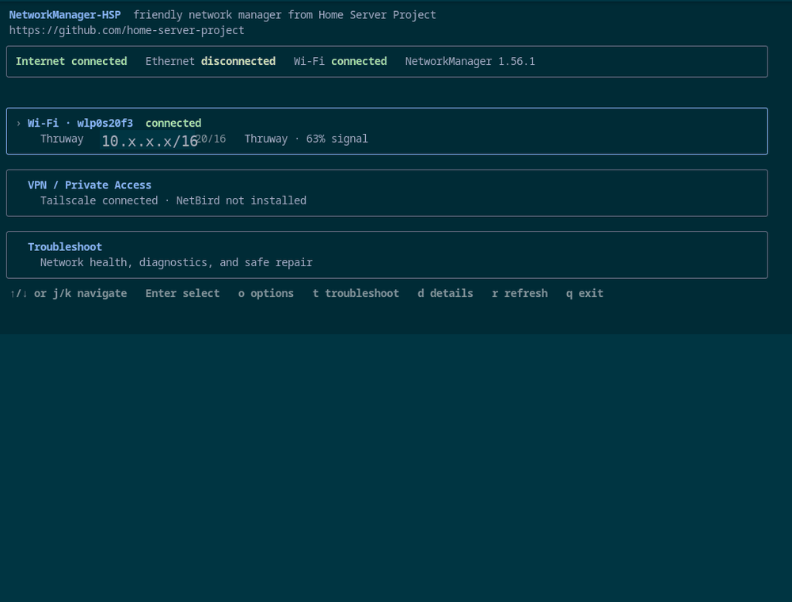

# NetworkManager-HSP

Friendly terminal network manager for Home Server Project systems.



`nm-hsp` is a keyboard-driven TUI for common network tasks on headless and appliance-style Linux systems. It uses NetworkManager directly over D-Bus and keeps normal users away from interface names and low-level configuration where possible.

## Features

- Ethernet status and configuration
- Wi-Fi scanning, connection, saved profiles, and radio control
- DHCP or manual IPv4/IPv6 configuration
- DNS, gateway, MTU, and autoconnect settings
- Tailscale and NetBird status and local lifecycle controls
- Friendly network diagnostics
- Conservative, reviewed repair actions
- Light and dark terminal themes
- Read-only JSON snapshot with `nm-hsp --snapshot`

## Run

Build and start the application:

```bash
go build -trimpath -o nm-hsp ./cmd/nm-hsp
./nm-hsp
```

Go 1.25 or newer is required for source builds.

Home Server Project images are expected to consume packaged nm-hsp builds rather than asking users to build it manually.

## Main controls

- Up/Down or `j`/`k` — move
- Enter — open the selected device or action
- `d` — show or hide device details
- `r` — refresh
- `o` — options and theme
- `t` — network health and repair
- Esc or `q` — back or exit

## Ethernet

Ethernet settings include DHCP or manual addressing, IPv4/IPv6, DNS, gateway, MTU, autoconnect, and saved profile management.

nm-hsp updates only the fields it owns and preserves unrelated NetworkManager profile settings.

## Wi-Fi

The Wi-Fi manager can scan networks, connect to saved profiles, create common personal-network profiles, manage autoconnect priority, forget profiles, and control the Wi-Fi radio.

Saved Wi-Fi passwords are not read back into the UI.

## Private Access

nm-hsp detects Tailscale and NetBird when installed.

It can:

- show whether the provider service is enabled and running
- show connection state and current VPN addresses
- start an inactive provider service
- connect or authenticate
- disconnect while leaving the service running
- stop the service for the current boot

nm-hsp does not install VPN providers and does not own their boot policy. The operating system or product image decides whether `tailscaled.service` or `netbird.service` is enabled at boot.

Packaged deployments can use the narrow Polkit rule in `contrib/polkit/49-nm-hsp-vpn.rules` so trusted users can start and stop only those two services without generic systemd control.

## Network health and repair

The diagnostics screen checks the normal path from adapter to Internet connectivity and explains problems in normal-user language.

Repairs are deliberately limited. Every repair is reviewed before it is applied, and nm-hsp re-checks current state before writing.

See [docs/diagnostics.md](docs/diagnostics.md) for the full diagnostic and repair model.

## Security

nm-hsp uses NetworkManager D-Bus directly and does not pass Wi-Fi passwords through shell commands or process arguments.

See [docs/security.md](docs/security.md) for credential-handling guarantees and limitations.

## Source layout

- `cmd/nm-hsp` — application entry point
- `internal/networkmanager` — NetworkManager integration
- `internal/vpn` — Tailscale, NetBird, and systemd integration
- `internal/ui` — terminal interface
- `internal/diagnostics` — health and repair logic
- `internal/security` — secret handling
- `internal/validation` — input validation

## Validation

```bash
gofmt -w .
go vet ./...
go test ./...
go build -trimpath -o /tmp/nm-hsp ./cmd/nm-hsp
```

## License

Apache License 2.0. See [LICENSE](LICENSE).
