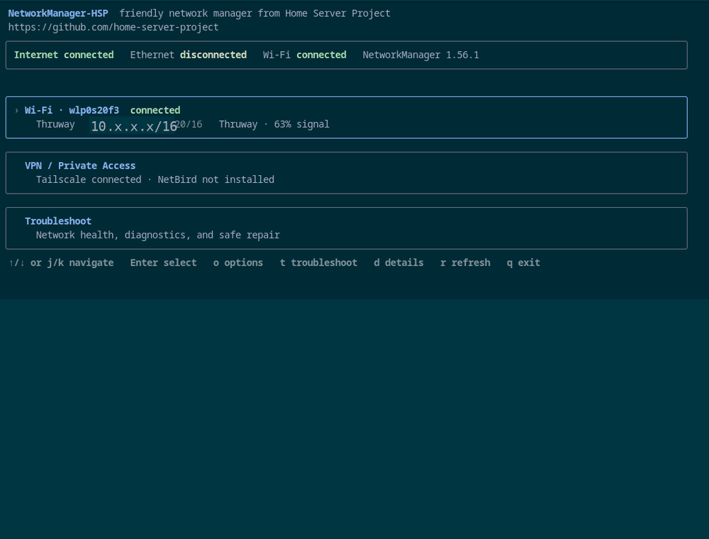

# NetworkManager-HSP

Friendly terminal network manager for Linux systems.



`nm-hsp` is a keyboard-driven NetworkManager interface for servers, homelabs, and Linux workstations. It uses NetworkManager directly and keeps common network tasks simple.

## What it does

- Shows live Ethernet and Wi-Fi status
- Connects to Wi-Fi and manages saved networks
- Configures DHCP or manual IP settings
- Manages DNS, gateway, MTU, and autoconnect
- Shows Tailscale and NetBird status when installed
- Provides friendly network diagnostics and guarded repairs
- Supports light and dark terminal themes
- Exposes a read-only JSON snapshot with `nm-hsp --snapshot`

## Install

### Homebrew

On Linux with Homebrew installed:

```bash
brew install home-server-project/tap/nm-hsp
```

Then launch:

```bash
nm-hsp
```

NetworkManager must be installed and running on the host.

The Homebrew formula is maintained in the [Home Server Project tap](https://github.com/home-server-project/homebrew-tap).

## Use

Start it with:

```bash
nm-hsp
```

Main controls:

- Up/Down or `j`/`k` — move
- Enter — open the selected item
- `d` — show or hide details
- `r` — refresh
- `o` — options and theme
- `t` — network health and repair
- Esc or `q` — back or exit

Home Server Project maintains packaged builds for its own systems. Homebrew packaging is available through the [Home Server Project tap](https://github.com/home-server-project/homebrew-tap). For other systems, see [Development and source build](docs/development.md).

## Ethernet

See connection state, address information, and saved profiles. Configure automatic or manual IPv4/IPv6, DNS, gateway, MTU, and autoconnect without working directly with low-level NetworkManager settings.

## Wi-Fi

Scan and connect to nearby networks, use saved profiles, manage autoconnect priority, forget networks, and control the Wi-Fi radio.

Saved Wi-Fi passwords are not read back into the application.

## Private Access

Tailscale and NetBird appear automatically when they are installed. nm-hsp can show their state and provide normal connect, disconnect, start, and stop controls.

See [Private Access details](docs/private-access.md) for service behavior and permissions.

## Troubleshoot

The network health screen follows the normal path from adapter to Internet connectivity and explains problems in normal-user language. Repair actions are intentionally limited and reviewed before they are applied.

See [Diagnostics and repair](docs/diagnostics.md) for the full model.

## Security

nm-hsp talks to NetworkManager directly over D-Bus and avoids putting Wi-Fi passwords into shell commands or process arguments.

See the [Security model](docs/security.md) for the full credential-handling design and limitations.

## More details

- [Development and source build](docs/development.md)
- [Private Access](docs/private-access.md)
- [Diagnostics and repair](docs/diagnostics.md)
- [Security model](docs/security.md)

## License

Apache License 2.0. See [LICENSE](LICENSE).
